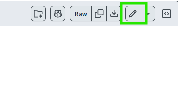

# 기여 가이드

ALCT에 관심 가져주셔서 감사합니다!🙌 버그 제보, 기능 제안, 용어집 기여를 환영합니다.

## 버그 제보 · 기능 제안

[이슈](../../issues/new/choose)를 열어주세요. 버그/기능 템플릿이 준비되어 있습니다.

- 버그는 **재현 방법**과 **환경(Windows 버전, ALCT 버전 등)** 을 함께 적어주시면 큰 도움이 됩니다.
- 로그(`%APPDATA%/ALCT/alct.log`)나 스크린샷을 첨부해주시면 더 빠르게 확인할 수 있습니다.

## 게임 용어집 기여

게임에서 자주 쓰는 용어(캐릭터·무기·아이템·스킬 명)를 미리 한국어로 바꿔주는 사전입니다. 깃허브 계정이 있는 사용자라면 **누구나** 참여할 수 있습니다.

수정할 파일: [`src/assets/glossary_data.json`](https://github.com/shu-rimp/alct/blob/main/src/assets/glossary_data.json)

**추가하는 법 (GitHub 웹에서)**

<p align="center">
  
</p>

1. 위 파일을 열고 편집(Edit) 아이콘을 누릅니다. (fork 안내가 뜨면 허용해 주세요.)
2. Ctrl+F로 내가 추가할 용어(한국어)가 이미 있는지 검색합니다.
3. 아래 형식에 맞춰, 있으면 기존 용어 뒤에 추가, 없으면 새 용어로 추가합니다.
4. **Commit changes** 로 저장하고 **Pull Request**를 올려 주세요.

알맞은 언어 블록 내에만 맞춰 적어주시면 줄 위치나 정렬은 신경 쓰지 않아도 됩니다. 자동으로 정리하고 검사합니다.

**형식**

- 왼쪽은 번역될 **한국어**, 오른쪽은 게임에서 그 대상이 **실제로 적히는 표기들**입니다.
- `common`: 언어를 가리지 않는 표기(주로 영어·약칭·로마자 일본어 표기)
- `languages` 아래 `ja-JP`(일본어), `zh-CN`(중국어): 각 언어의 표기

```json
{
  "common": {
    "옥테인": ["octane", "octa"]
  },
  "languages": {
    "ja-JP": {
      "옥테인": ["オクタン"]
    }
  }
}
```

⚠️주의: **너무 짧은 단어**(한두 글자 등)는 다른 말에 잘못 끼어들어 오히려 번역 품질이 저하되거나 일상 대화를 망가뜨릴 수 있습니다. 해당 단어가 게임 내에서 아주 빈번하고 중요하게 쓰이지만 일반 번역기로는 번역되지 않는 경우에만 추가해 주세요.

## 코드 기여

고치고 싶은 부분이나 새 기능을 직접 구현하고 싶다면, 먼저 [이슈](../../issues/new?template=code_contribution.md)로 얘기해 주세요. 함께 방향을 정한 뒤 진행하면 좋습니다. 사소한 오타/주석 수정같이 앱 동작에 무관한 작업일 경우 바로 올려주셔도 좋습니다.

1. 저장소 fork 후 로컬에 클론합니다.
2. 새 작업 브랜치를 생성합니다.(예: `chore/typo-correction`)
3. 변경 사항 push 후 PR을 생성합니다.

**필요 개발 환경**

- Windows 11 22H2 이상
- [.NET 8 SDK](https://dotnet.microsoft.com/download/dotnet/8.0)
- [Git LFS](https://git-lfs.com/) - OCR 모델(`src/assets/models/v5/*.onnx`)이 LFS로 관리됩니다. clone 전 `git lfs install`을 실행해 주세요. (이미 clone했다면 `git lfs pull`)
- 빌드/테스트: `dotnet build`, `dotnet test Tests/AlctClient.Tests.csproj` (앱이 실행 중이면 파일 잠금으로 빌드가 실패합니다 - 종료 후 빌드)

**꼭 지켜주세요**

- **게임 프로세스에 관여하는 코드 금지** - 게임 프로세스에 관여하는 모든 코드 및 마우스/키보드 합성 입력 주입(`SendInput`)을 도입하지 마세요(안티치트 제약).
- **라이브 캡션 로직(`CaptionMonitorService`) 수정은 이슈로만 제안해주세요.** 폴링 타이밍에 매우 민감해 작은 변경도 과거 버그를 회귀시키기 쉽고, 코드 상으로 확인이 어려운 부분이 많아 직접 모든 발화 케이스를 재검토해야 합니다. 관련 버그나 개선 아이디어를 [이슈](../../issues/new/choose)로 알려주시면 참고해 추후 업데이트에 반영하겠습니다. (동작 설계: [`docs/caption_monitor_logic.md`](docs/caption_monitor_logic.md))
- **코드 스타일** 
  - 클래스/메서드명: `PascalCase` 
  - 변수: `camelCase`(프라이빗 필드: `_camelCase`) 
  - 상수: `UPPER_SNAKE_CASE`
  - 비동기 메서드는 `Async` 접미사(`TranslateToKoeanAsync`)
  - 로그 메시지: 영어, UI 문구: 한국어(해요체)
  - 이외 코드/주석 스타일에는 따로 제한을 두지 않습니다.

## 라이선스

기여해주신 내용은 프로젝트와 동일하게 [Apache License 2.0](LICENSE)으로 배포됩니다.
