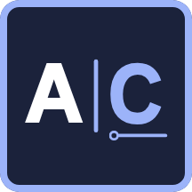
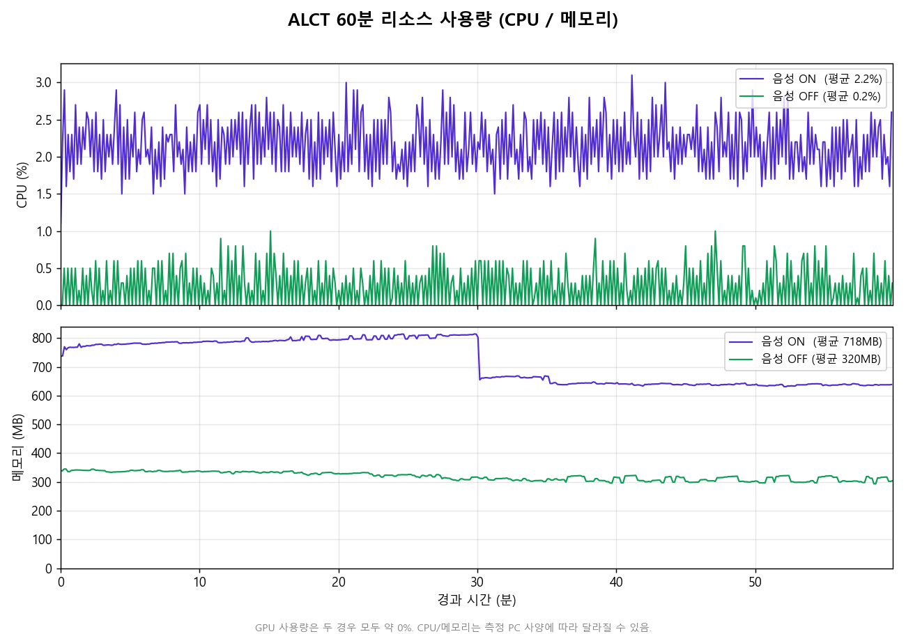
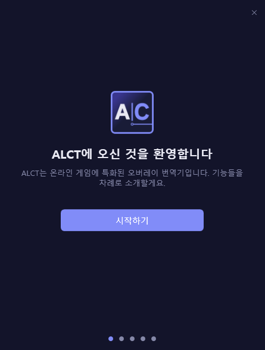
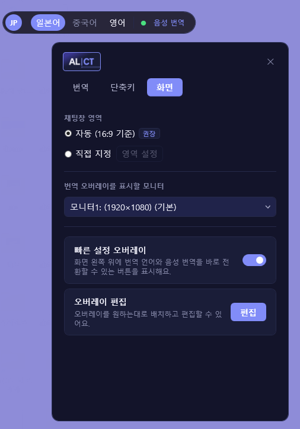
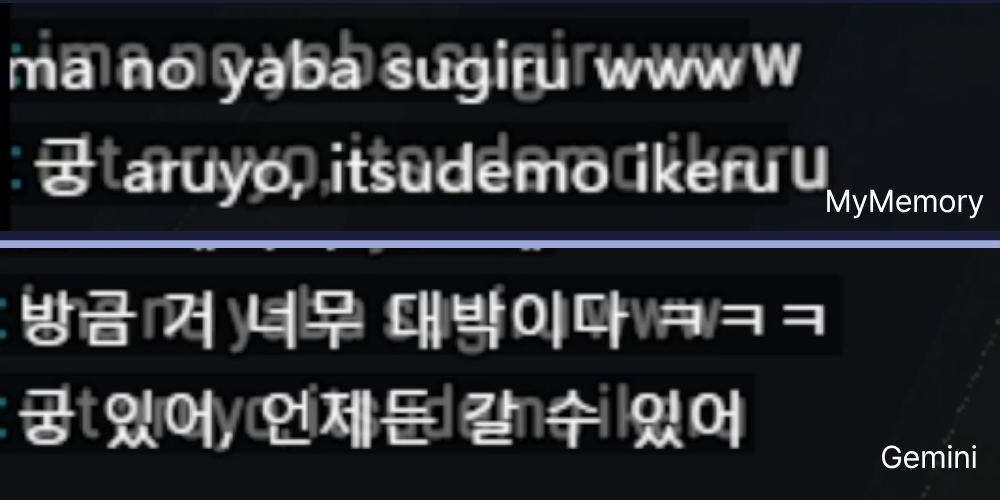

<h1 align="center">ALCT</h1>

<p align="center">
  
</p>
<p align="center">
  <b>한국어</b> | <a href="README.en.md">English</a> 
</p>

<p align="center">
  
  
  
</p>

<p align="center">
  ALCT는 외국어 텍스트와 음성을 한국어로 번역해 화면 위에 띄우는 <b>실시간 번역 오버레이</b>입니다.<br/> 온라인 게임 환경에 특화되어 있으며, 현재는 'Apex Legends' 기준으로 다듬어져 있습니다.<br/>
  번거로운 조작 없이 팀원의 음성과 채팅, 그리고 내 채팅을 쉽고 빠르게 번역합니다.
</p>


> ALCT는 외국어(일본어 · 중국어(간체) · 영어)를 **한국어로** 번역합니다. (다른 언어 지원은 검토 중입니다.)


---

## 요약

ALCT는 화면에 보이는 텍스트(또는 음성)을 읽어, 게임 위에 투명 오버레이로 한국어 번역을 띄웁니다. **게임 프로세스에 절대 개입하지 않으며**, 디스코드·OBS 등의 단순 유틸 오버레이와 같은 방식으로 동작합니다.

**1. 가볍습니다** — 1프레임 단위에도 민감한 게이머들을 위해, 번역은 외부 번역 서비스 API에서 처리하고 채팅 OCR은 단축키를 누른 순간에만 기기 내에서 가볍게 동작하도록 설계하여 부담을 최소화했습니다.

<details>
<summary>리소스 사용량 측정 그래프 (펼치기)</summary>
측정 환경: AMD Ryzen 7 9800X3D 8-Core Processor (8C/16T) · RAM 32GB · NVIDIA GeForce RTX 4070 Ti · Windows 11 Pro 25H2
<br/>

60분 연속 발화, 채팅 15초·입력 30초마다 트리거하며 기록. GPU 사용량은 두 경우 모두 약 0% 입니다.

- **전 기능 사용 시(ALCT+Live Captions)** — 지속 발화 음성 번역 + 채팅 번역 + 입력 번역: CPU 평균 약 2%, 메모리 약 720 MB 수준
- **음성 번역 OFF 시(ALCT 단독)** — CPU 평균 약 0.2%, 메모리 약 320 MB 수준으로 더 낮아집니다.

<p align="center">
  
</p>

> 위 수치는 모든 기능을 활성화한 채로 테스트한 결과로, 일반적인 사용 환경에서는 이보다 적게 측정됩니다.<br/>
> '음성 모드ON' 그래프 중간의 메모리 급락은 Live Captions가 자체적으로 메모리를 회수할 때 나타나는 정상적인 현상입니다. 장시간 사용해도 메모리 누수 없이 일정 범위에서 유지됨을 보여줍니다.<br/>
> *CPU/메모리 수치는 측정 PC 사양에 따라 달라질 수 있습니다.
</details><br/>

**2. 쉽습니다** — 최대한 게임 환경에만 몰입할 수 있도록 번거로운 작업과 UI를 최소화하고, 편의성을 위한 다양한 맞춤 설정을 제공합니다. 설치 시 기능 소개 및 설정을 돕는 온보딩을 통해 자연스럽게 사용방법을 익힐 수 있습니다.

<details>
<summary>예시 화면 (펼치기)</summary>

<br/>

유저 플로우 기반의 온보딩, 번역 언어·엔진, 단축키, 오버레이 편집 등 다양한 설정을 직관적인 UI로 제공합니다.

<table>
<tr>
<td align="center"></td>
<td align="center"></td>
</tr>
</table>

</details><br/>

**3. 정확합니다** — 게임 특화 용어집 전처리를 통해 자주 쓰이는 용어들은 미리 번역합니다. 모든 번역 엔진에 동일하게 적용됩니다. 용어집은 앱 업데이트 없이 자동으로 최신 상태로 갱신됩니다. Gemini 또는 DeepL 번역 엔진 선택 시 은어 또는 로마자 일본어 표기(예: yorosiku) 같은 까다로운 번역도 준수한 품질로 제공합니다. 

<details>
<summary>번역 엔진별 예시 (펼치기)</summary>

<br/>

기본 엔진(MyMemory)과 Gemini의 번역 예시입니다. 로마자 일본어(`ima no yaba sugiru www`)나 은어처럼 까다로운 입력일수록 차이가 큽니다.

<p align="center">
  
</p>

</details><br/>


## 기능

세 가지 기능을 제공합니다.

### 🎙️ 음성 번역

`실시간 음성 번역` 토글을 활성화하면 음성이 감지될 때 자동으로 한국어 자막을 생성합니다. 자연스러운 대화 단위로 묶어 번역하며, 팟캐스트처럼 빠르고 지속적인 발화에도 안정적으로 자막을 제공합니다.

> 이 기능은 **Windows 11 라이브 캡션(Live Captions)** 을 사용하므로 **Windows 11 22H2 이상**에서만 사용할 수 있습니다.


### 💬 채팅 번역 `기본: Ctrl+T`

단축키를 누르면 채팅창 영역을 캡처해 번역 결과를 오버레이로 표시합니다.


### ⌨️ 입력 번역 `기본: Ctrl+G`

입력한 채팅을 복사 후 단축키를 누르면 ALCT가 대상 언어로 번역해 클립보드에 넣어줍니다. `Ctrl+V`로 붙여넣어 사용합니다. 

> 번역은 단축키를 누를 때만 동작하므로, 평소의 복사·붙여넣기에는 영향을 주지 않습니다.


---


## 설치

[릴리스 페이지](https://github.com/shu-rimp/alct/releases/latest)에서 최신 **`ALCT.exe`** 를 다운로드해 실행합니다. 최초 실행 시 기능 소개 및 설정을 돕는 온보딩이 진행됩니다.

> **⚠️ SmartScreen 경고.** ALCT는 개인이 개발한 서명되지 않은 오픈소스 실행 파일이므로, Windows가 *"Windows의 PC 보호"* 경고를 띄울 수 있습니다. 서명되지 않은 앱에서 정상적으로 나타나는 현상입니다. **추가 정보 → 실행** 을 누르면 실행됩니다.


---

## 작동 방식

```
음성 번역:   Windows 라이브 캡션 → UI Automation 폴링 → 번역 API → 자막 오버레이
채팅 번역:   단축키 → 화면 캡처 → 온디바이스 OCR → 번역 API → 오버레이
입력 번역:   클립보드(한국어) → 번역 API → 클립보드(번역문) → 사용자가 붙여넣기
```

- **OCR** 은 기기 내(온디바이스)에서 처리되어 화면 이미지가 외부로 전송되지 않습니다.
- **번역** 은 **사용자 본인의 API 키** 를 사용해 클라이언트가 직접 번역 서비스 API로 전송합니다: MyMemory(기본, 키 불필요), DeepL, Gemini.
- 데이터 처리·개인정보에 관한 전체 내용은 [개인정보 처리방침](PRIVACY.md)을 참고하세요.

---

## 기여해 주세요!💫

버그 제보, 기능 제안, 용어집·코드 기여 모두 환영해요 — [기여 가이드](CONTRIBUTING.md)를 참고해주세요.        

---

## 기술 스택

| 항목 | 내용 | 버전 |
|---|---|---|
| 언어 | C# | 12 |
| 런타임 | .NET (net8.0-windows) | 8 |
| 배포 | self-contained · win-x64 · single-file (런타임 번들) | — |
| UI | WPF + WPF-UI | 3.1.1 |
| 화면 캡처 | System.Drawing.Common | 8.0.0 |
| OCR 엔진 (기본) | Windows 내장 OCR (캡처 도구) ※ | OS 제공 |
| OCR 엔진 (폴백) | RapidOcrNet + ONNX Runtime + SkiaSharp · PP-OCRv5 mobile | 2.0.0 |
| API 키 암호화 | System.Security.Cryptography.ProtectedData (DPAPI) | 8.0.0 |
| 시스템 정보 | System.Management | 8.0.0 |
| 전역 단축키 | RegisterHotKey (Win32 / P/Invoke) | — |
| 오버레이 | WS_EX_TRANSPARENT + WS_EX_LAYERED (Win32) | — |
| 테스트 | xUnit / Moq / Microsoft.NET.Test.Sdk | 2.9.3 / 4.20.72 / 18.6.0 |

> ※ **내장 OCR(캡처 도구)** 은 사용자 PC에 설치된 Windows 내장 OCR을 런타임에 로드합니다(앱에 번들·재배포하지 않음). 미설치·초기화 실패 시 폴백 엔진(RapidOcr)으로 자동 전환됩니다. 자세한 내용은 [THIRD_PARTY_NOTICES.md](THIRD_PARTY_NOTICES.md)를 참고하세요.

---

## 라이선스

[Apache 2.0](LICENSE) © 2026 shu-rimp

---

## 이용약관 및 면책 조항

ALCT는 비영리 오픈소스 개인 프로젝트이며, 어떠한 보증도 없이 **"있는 그대로(as-is)"** 제공됩니다. 설치·사용 시 아래에 동의한 것으로 간주합니다.

### 안티치트 및 게임 이용약관

ALCT는 게임 클라이언트에 절대 개입하지 않고, 외부에서 화면을 읽어 번역 결과만 표시하도록 설계되었습니다. 구체적으로 본 프로그램은 다음을 **수행하지 않습니다.**

- 게임 프로세스에 대한 메모리 읽기/쓰기
- 게임 프로세스에 대한 DLL·코드 인젝션
- 게임 렌더링(DirectX 등)에 대한 후킹
- 키보드·마우스 입력의 가상(합성) 주입 — 모든 선택·복사·붙여넣기는 사용자의 실제 키 입력으로만 이루어집니다.
- 저수준 키보드 후킹을 통한 입력 감시
- 게임 플레이에 이득을 줄 수 있는 행위

번역 결과를 표시하는 오버레이는 게임 프로세스에 주입되지 않는 **독립된 최상위 창**으로, Discord·OBS 등의 단순 유틸 오버레이와 동일한 방식으로 동작합니다.

다만 위 설계가 특정 게임의 안티치트 시스템이나 이용약관에서 제재받지 않음을 보장하지는 않습니다. 안티치트의 탐지 정책은 비공개이며 게임마다 다르고 수시로 변경될 수 있습니다. 또한 일부 게임은 기술적 안전성과 무관하게 **제3자 오버레이·화면 캡처 소프트웨어의 사용 자체를 약관으로 제한**할 수 있습니다. 본 프로그램 사용으로 인한 계정 제재 등 어떠한 불이익에 대해서도 개발자는 책임지지 않으며, 사용 여부 및 해당 게임 이용약관의 준수는 전적으로 사용자 본인의 판단과 책임에 따릅니다.

### 데이터 · 면책 · 상표

- **데이터** — 사용자 데이터를 저장하지 않습니다. 번역은 사용자 본인의 API 키로 각 번역 서비스가 처리하며 개발자는 그 경로에 관여하지 않습니다. 자세한 내용은 [개인정보 처리방침](PRIVACY.md)을 참고하세요.
- **면책** — 본 소프트웨어의 사용 또는 사용 불능으로 발생하는 어떠한 손해에 대해서도 개발자는 책임지지 않습니다.
- **상표** — ALCT는 비공식 제3자 도구로 Electronic Arts·Respawn과 제휴·후원 관계가 없으며, 'Apex Legends' 등 모든 상표와 README·온보딩 영상에 사용된 게임 영상·이미지의 권리는 각 권리자에게 있습니다.
